## Team Project Team 03 - Demonstration (Latest Analyser v2)

| Screenshot | Description |
| :---: | :---: |
| 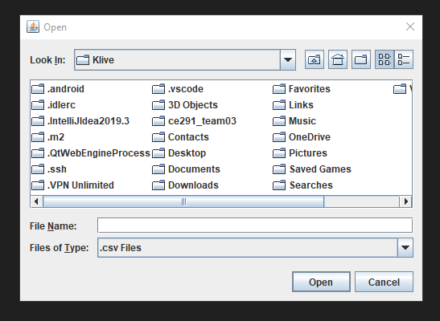 | Upon launch, user is asked to search for file to analyse, requires a CSV file to run (can manually set to All Files but not recommended). |
| 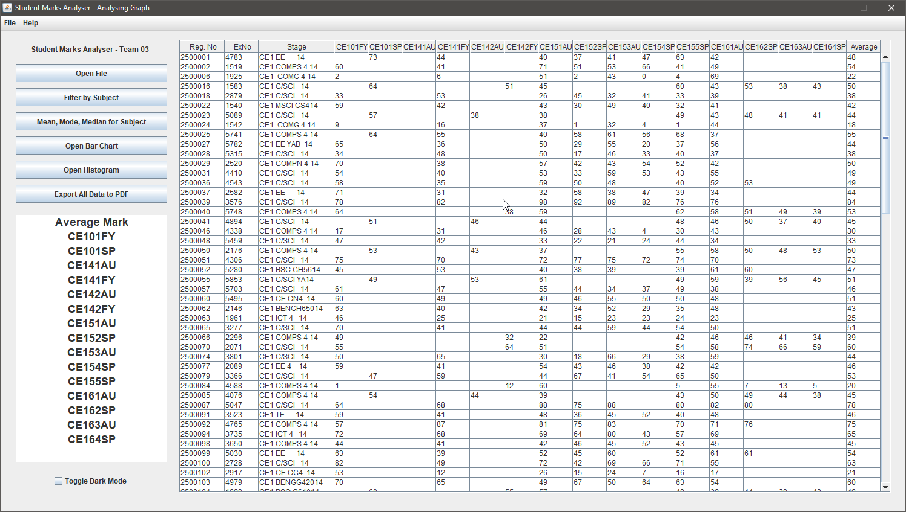 | Once successfully opened, the product will output the data in a consise format - with this window you can Filter By Subject, Open Bar Graphs/ Histograms of x Subject, Export Data to PDF. |
| 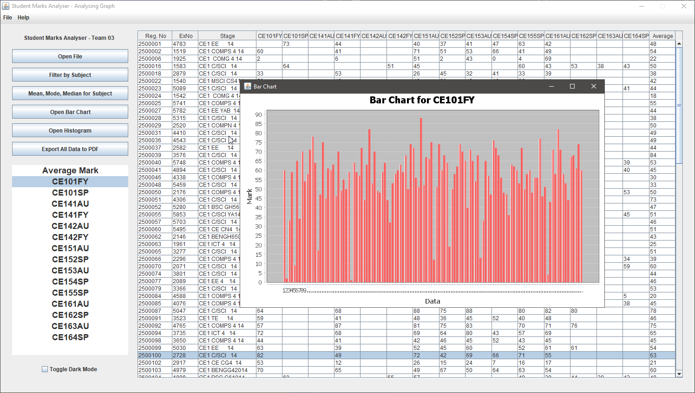 | When Selecting a Subject, you can open a Bar Chart for the said subject |
| 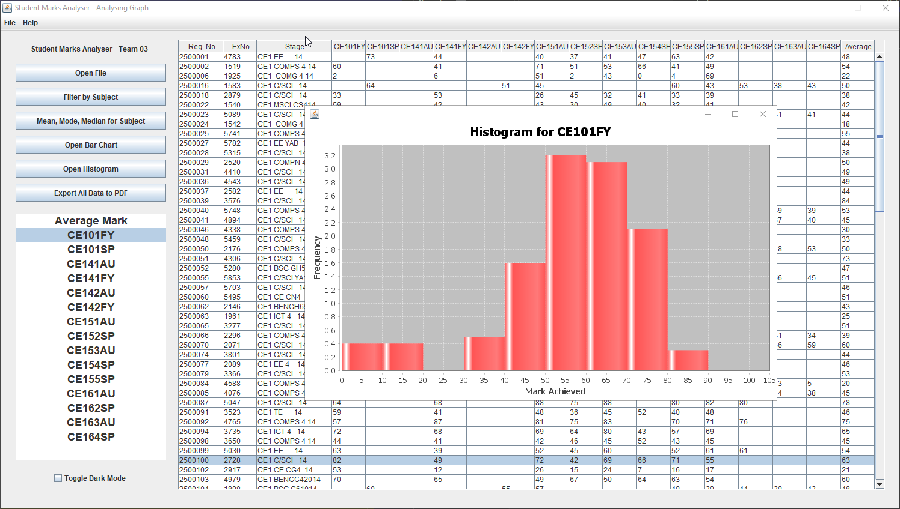 | Same subject, but in Histogram Format |
| 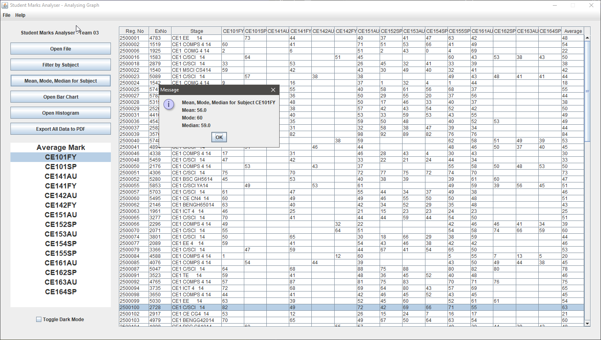 | If you would like to find out the Statistics for Mean Mode and Median Values for the subject, you can output it on the Button |
| 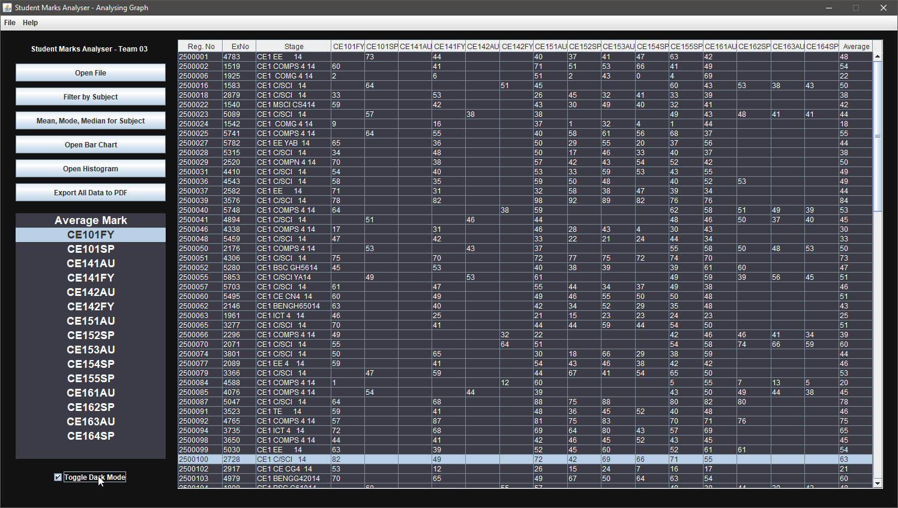 | Night Mode is created for a Theme Change, this is useful for those with eye fatigue etc. |
| 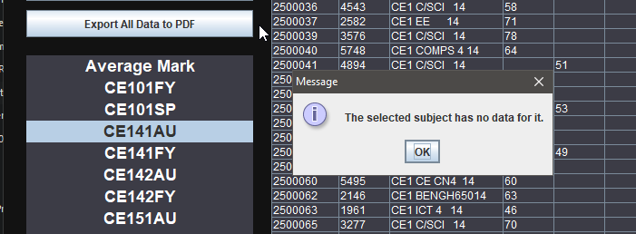 | Relevant Error Codes are Outputted on Empty Data |
| 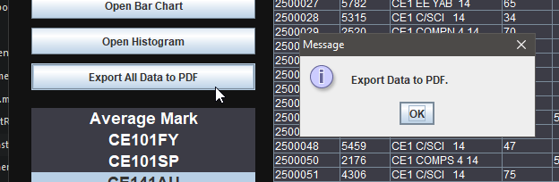 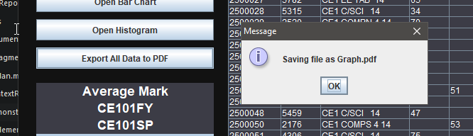 | Exporting the Data to a PDF file is done by clicking "Export Data to PDF", it will output all the Different Subjects with the data |
|  | Relevant Error Codes are Outputted on Empty Data |
| 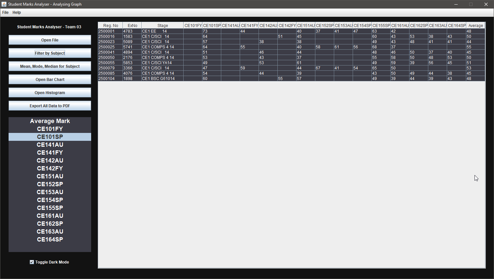 | To Filter By Subject, you have to select a subject in the list on the left side - and then click the Button to "Filter By Subject" |
| 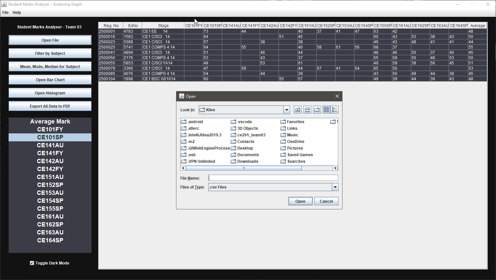 | Opening a new File is possible by Clicking "Open File" - This eliminates the ability to needing to relaunch the program |
| 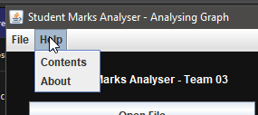 | The Context Menu on the Top Left will provide Support And About in the Product |

