# Student Marks Analyser Test report  - Team 03

## Testing performed

We have tried different types of tests:

* Functional Tests:
Stress Testing

* Non-Functional Tests:
JUnit Testing

## Functional Tests:

| Test | Description | Screenshot | Result |
| :---: | :---: | :---: | :---: |
| Open the File Multiple Times | Launch the file about 10 times, and see if there is no slowdown- halt in program | 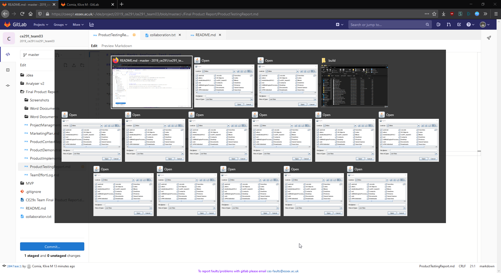 | Pass |
| Incorrect File | Open Incorrect File and test if any incorrect outputs occur | 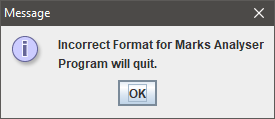 | Pass, correct output given |
| Correct File | Open correct .csv file and see if output is correct | 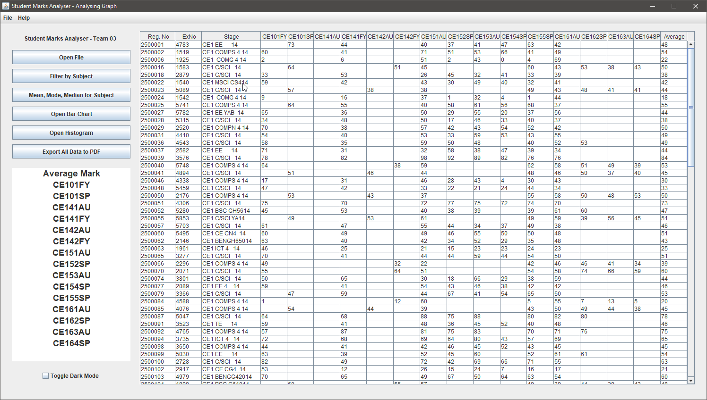 | Pass, example file given is identical to csv |
| No Selection | Try and use the functions without giving a selection on the JList |  | Pass, correct error message given |
| Filter by Subject | Test to see if product is actually filtering the correct data | 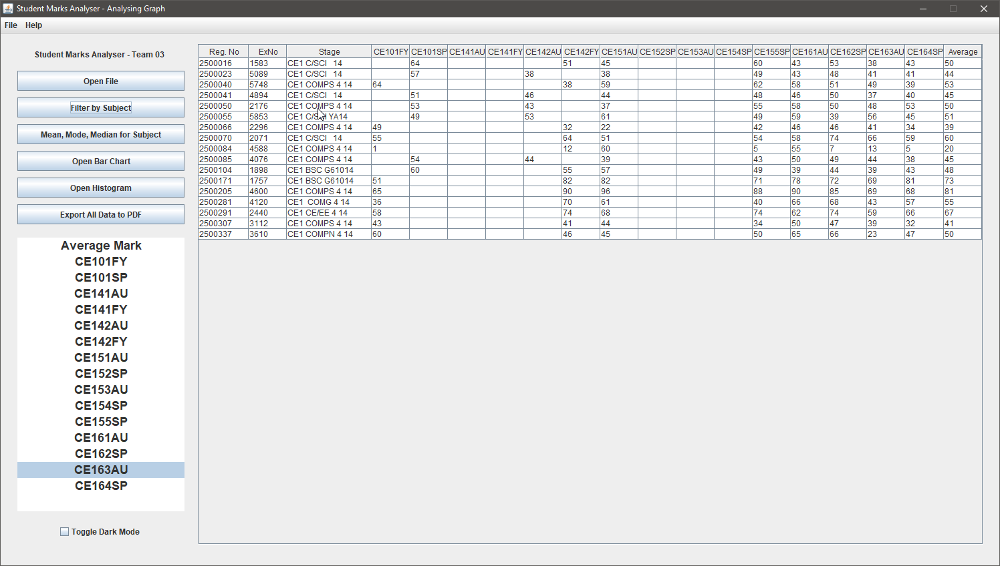 | Pass, data is being filtered correctly |
| Test Mean, Mode, Median Function | Run the Value to test Mean Mode Median on one of the subjects | 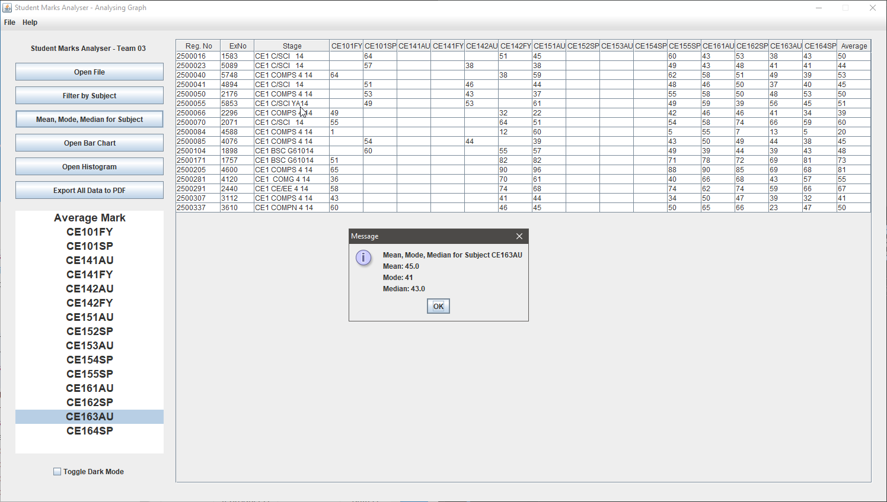 | Pass, provides correct values - tested with odd and even length arrays to test average of even length median etc. |
| Bar Chart | Test if the use of JFreeChart BarCharts work | 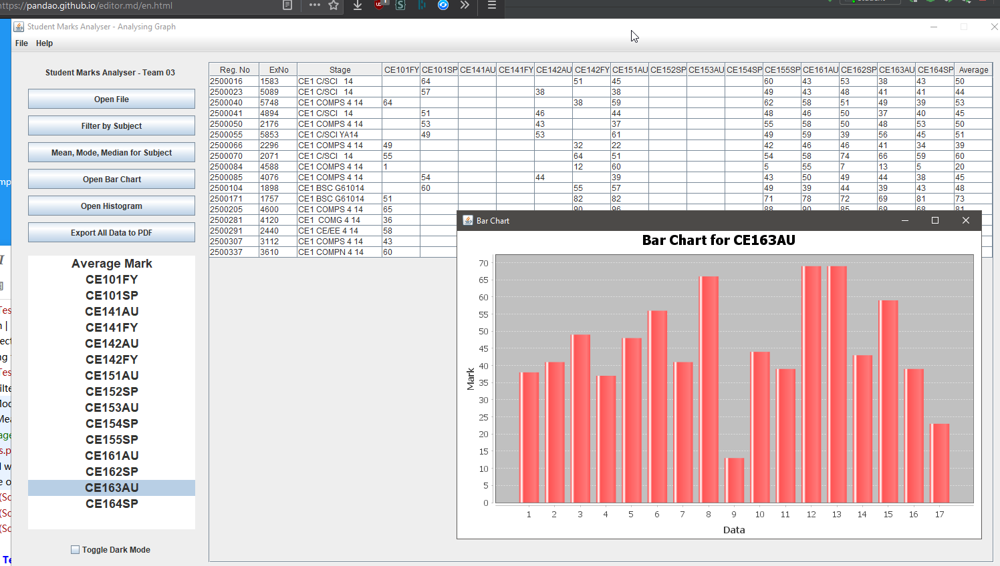 | Pass, outputs nice clear Bar Chart |
| Histogram | Test if use of the Histogram class is working | 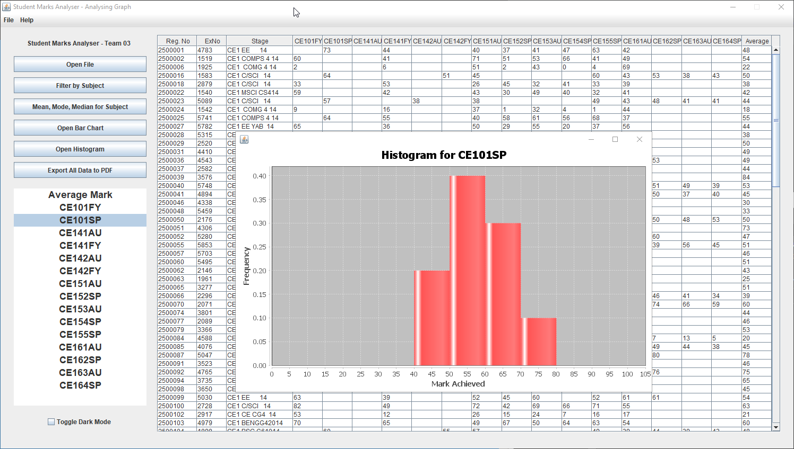 | Pass, outputs nice clear Histogram |
| Export PDF | Test to see if the product will output data correctly | 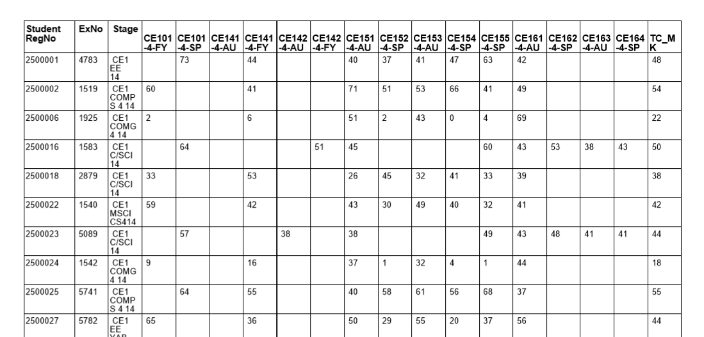 | Pass - but wanted to export more than just the main table, future feature? |
| Open New File on Current Table | Use the Open File Function on a running program to see if it loads properly | 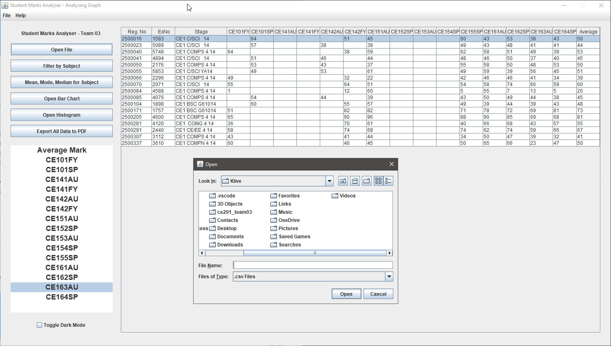 | : |
| Night Mode | Test if Night Mode Outputs Correctly | 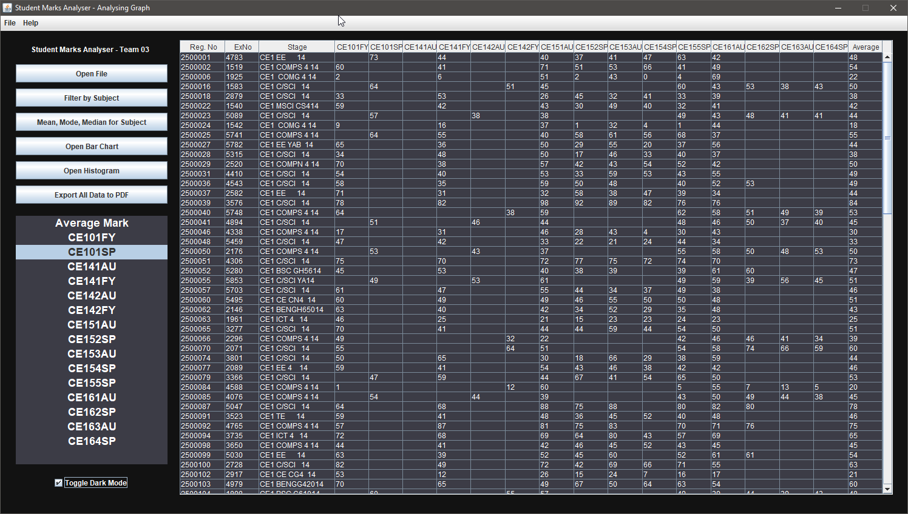 | Pass, correct colour palette |
| Rapid Click Night Mode (Attempt To Break) | Rapidly Click Night Mode Toggle to see if program will break |  | Pass, program did not halt (flashing lights warning) |
| Test Context Menu | Utilise and test the Top Left Functions in the Context Menus | 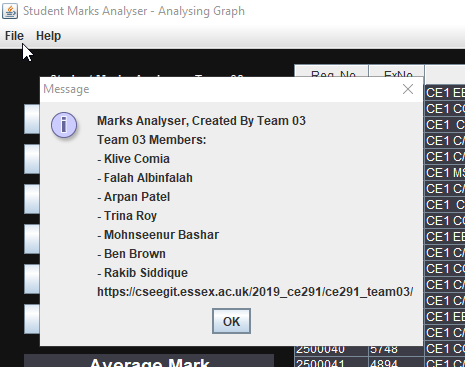 | Pass, items work and output relevant info. |
| Multiple Histograms/BarCharts | Open Multiple Instances of the Histogram/Bar Chart Function to see if program will halt | 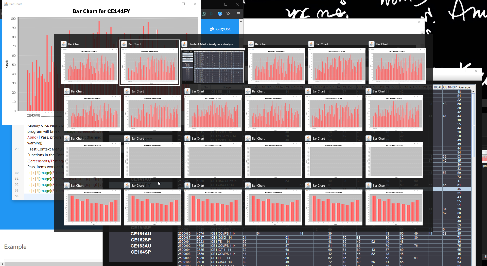 | Pass, Program still working as intended |

## Automatic Testing:
There is a JUnit Testing File called StudentTest.class and it has been made to run JUnit tests on the Program.
